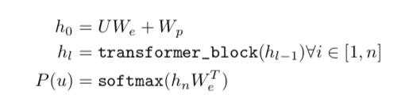
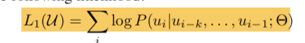
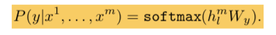
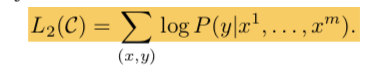
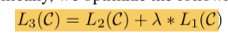

#### Paper
- Link:
- Author:
- Conference:

#### Outline
- [ ] Abstract
- [ ] Introduction
- [x] Framework
- [ ] Results
- [ ] Conclusion
- [ ] Research Background
- [ ] What to read next

#### Framework
- Unsupervised Pre-training: (Language Modeling)
  - Standard Language Modelling with Transformers.
  - Used Multilayered Transformer Decoder [34] for language training.
    - Multilayer Transformer Decoder ??

  
  
 ( W_e: embedding matrix, W_p: position embedding, U: context vector ) 

  - training objective:

  
  
 ( W_e: embedding matrix, W_p: position embedding, U: context vector ) 

- Supervised fine tuning
  - Use output of transformer block from last unsupervised pre-training
  - Task specific transfer learning with labelled dataset using **softmax activation** (or non linear activation).
  - Maximize likelihood of the label.

  
  
 ( h_l: output of pre-trained transformer, W_y: dense layer weight matrix) 

  - Loss

  

- Auxiliary objective function for optimization:
  - Previous work [50, 43] ??

  

- Task Specific Input Transformation or Preprocessing
  - Put Some Delim(e.g. $) between premise p and hypothesis h. 
